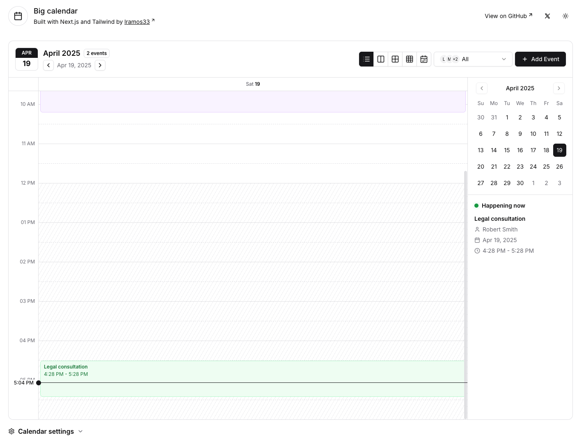
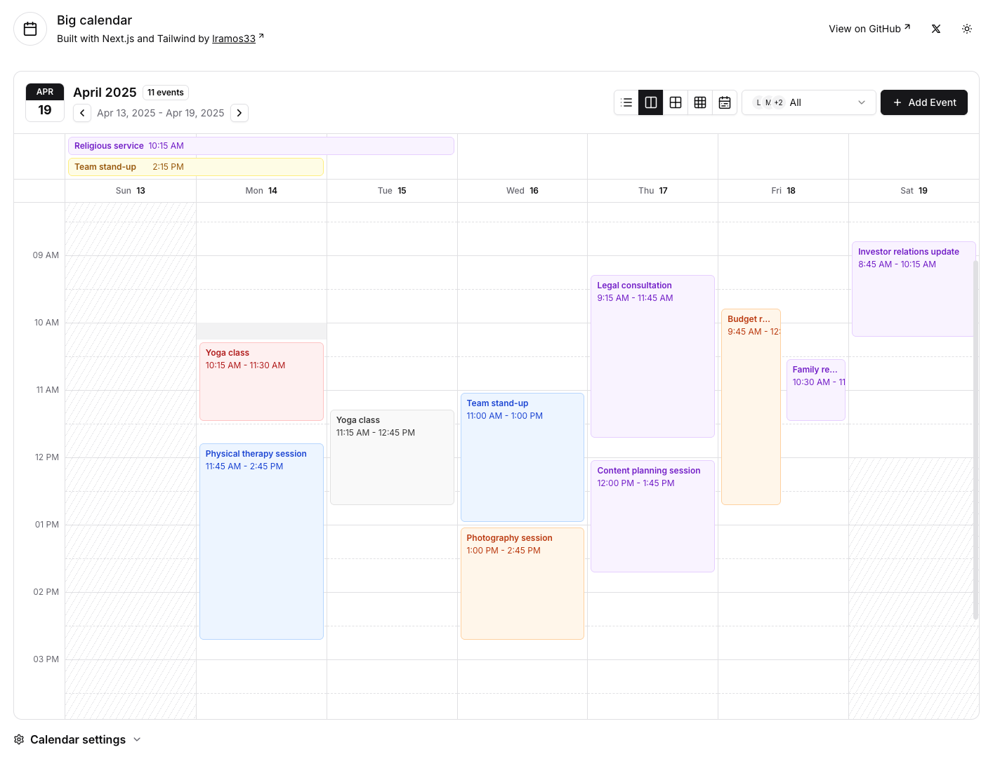
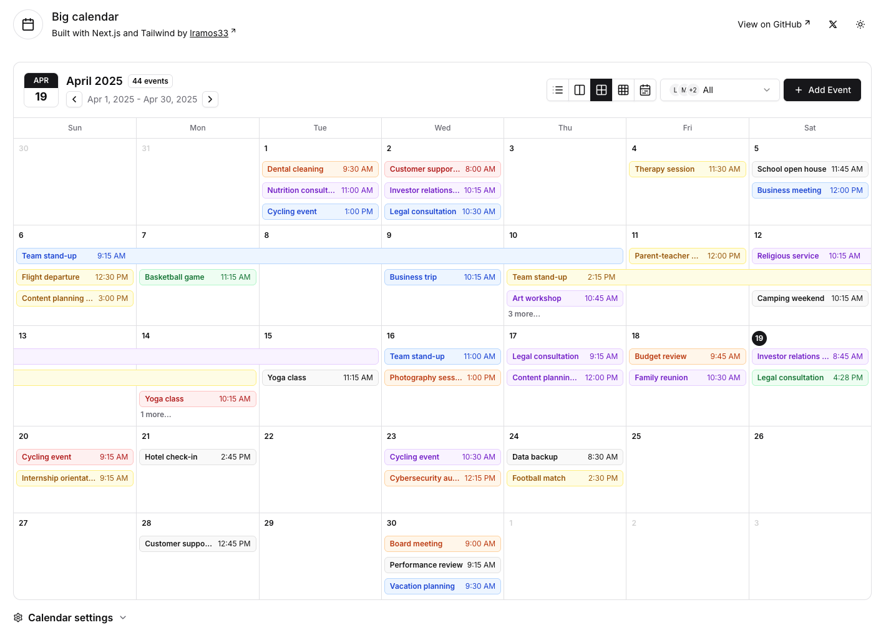
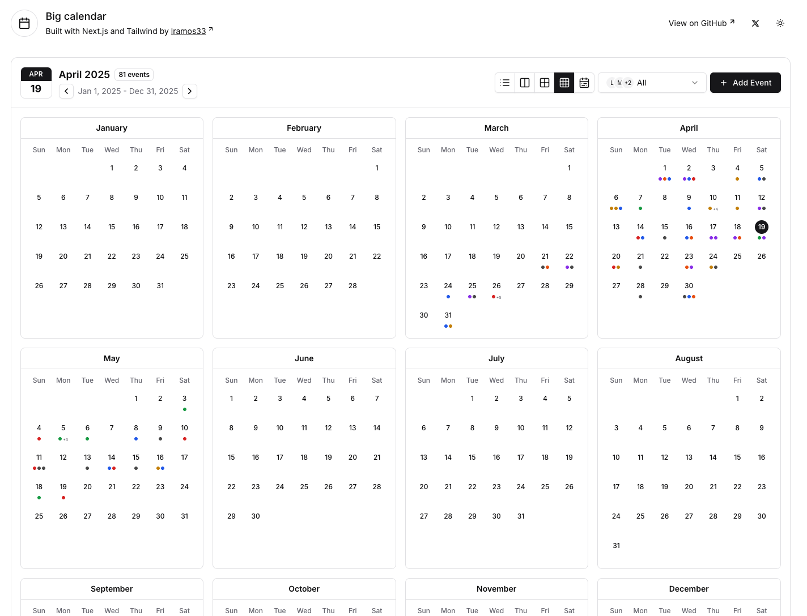
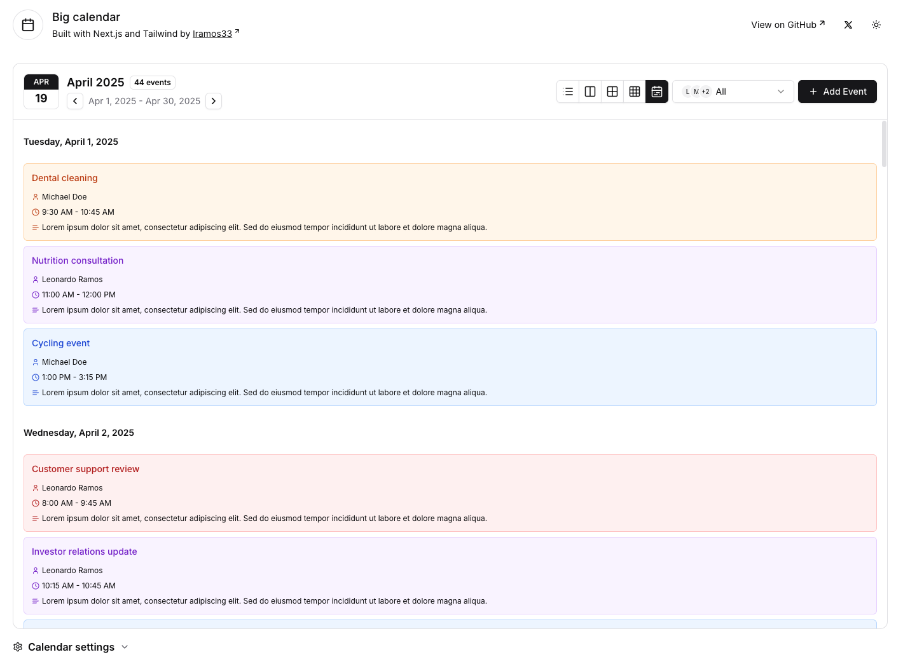

# Big Calendar

A feature-rich calendar application built with Next.js, TypeScript, and Tailwind CSS. This project provides a modern, responsive interface for managing events and schedules with multiple viewing options.

<p align="center">
  <a href="https://www.buymeacoffee.com/lramos33" target="_blank"></a>
</p>

## Preview







## Features

- 📅 Multiple calendar views:

  - Agenda view
  - Year view
  - Month view
  - Week view with detailed time slots
  - Day view with hourly breakdown

- 🎨 Event customization:

  - Multiple color options for events
  - Three badge display variants (dot, colored and mixed)
  - Support for single and multi-day events

- 🔄 Drag and Drop:

  - Easily reschedule events by dragging and dropping
  - Move events between days in month view
  - Adjust event timing in week/day views
  - Visual feedback during dragging operations

- 👥 User management:

  - Filter events by user
  - View all users's events simultaneously
  - User avatars and profile integration

- ⚡ Real-time features:

  - Live time indicator
  - Current event highlighting
  - Dynamic event positioning

- ⏰ Time customization:

  - Configurable working hours with distinct styling
  - Adjustable visible hours range
  - Focus on relevant time periods

- 🎯 UI/UX features:
  - Responsive design for all screen sizes
  - Intuitive navigation between dates
  - Clean and modern interface
  - Dark mode support

## Tech stack

- **Framework**: Next.js 14
- **Language**: TypeScript
- **Styling**: Tailwind v3
- **Date Management**: date-fns
- **UI Components**: shadcn/ui
- **State Management**: React Context

## Getting started

1. Clone the repository:

```bash
git clone https://github.com/yourusername/calendar-app.git
cd calendar-app
```

2. Install dependencies:

```bash
npm install
```

3. Start the development server:

```bash
npm run dev
```

or

```bash
npm run turbo
```

4. Open your browser and navigate to `http://localhost:3000` to view the application.

## Project structure

The project structure is organized as follows:

```
src/
├── app/
├── calendar/                     # All files related to calendar are in this folder
│   ├── components/
│   │   ├── agenda-view/          # Agenda view components
│   │   ├── dialogs/              # Dialogs components
│   │   ├── dnd/                  # Drag and drop components
│   │   ├── header/               # Calendar header components
│   │   ├── month-view/           # Month view components
│   │   ├── week-and-day-view/    # Week and day view components
│   │   └── year-view/            # Year view components
│   ├── contexts/                 # Calendar context and state management
│   ├── helpers/                  # Utility functions
│   ├── interfaces/               # TypeScript interfaces
│   └── types/                    # TypeScript types
└── components/                   # Components not related to calendar eg: ui and layout components
```

## How to implement in your project

### Installation

1. Copy the required folders to your project:

```
src/calendar/         # Core calendar functionality
src/components/ui/    # UI components used by the calendar
src/hooks/            # Required hooks like use-disclosure
```

2. Install dependencies missing in your project

### Basic setup

1. **Set up the `CalendarProvider`**

   Wrap your application or page with the `CalendarProvider`:

```tsx
import { CalendarProvider } from "@/calendar/contexts/calendar-context";

// Fetch your events and users data
const events = await getEvents();
const users = await getUsers();

export default function Layout({ children }) {
  return (
    <CalendarProvider users={users} events={events}>
      {children}
    </CalendarProvider>
  );
}
```

2. **Add a `CalendarView`**

   Use the `ClientContainer` to render a specific view:

```tsx
import { ClientContainer } from "@/calendar/components/client-container";

export default function CalendarPage() {
  return <ClientContainer view="month" />;
}
```

### Views configuration

The calendar supports five different views, each can be used with the `ClientContainer` component:

```tsx
// Day view
<ClientContainer view="day" />

// Week view
<ClientContainer view="week" />

// Month view
<ClientContainer view="month" />

// Year view
<ClientContainer view="year" />

// Agenda view
<ClientContainer view="agenda" />
```

### Data structure

1. **Events Format**

   Events should follow this interface (you can modify it as you want, but the calendar will expect these fields):

```tsx
interface IEvent {
  id: string;
  title: string;
  description: string;
  startDate: string; // ISO string
  endDate: string; // ISO string
  color: "blue" | "green" | "red" | "yellow" | "purple" | "orange";
  user: {
    id: string;
    name: string;
  };
}
```

2. **Users format**

   Users should follow this interface (you can modify it as you want, but the calendar will expect these fields):

```tsx
interface IUser {
  id: string;
  name: string;
  picturePath?: string; // Optional avatar image
}
```

### Customizing the calendar

1. **Badge Variants**

   You can control the event display style with the `ChangeBadgeVariantInput` component:

```tsx
import { ChangeBadgeVariantInput } from "@/calendar/components/change-badge-variant-input";

// Place this anywhere in your project tree inside the CalendarProvider
<ChangeBadgeVariantInput />;
```

2. **Creating events**

   Implement your own event creation by modifying the `onSubmit` handler in the `AddEventDialog` component.

### Using the Calendar Context

You can access and control the calendar state from any component using the `useCalendar` hook:

```tsx
import { useCalendar } from "@/calendar/contexts/calendar-context";

function MyComponent() {
  const { selectedDate, setSelectedDate, selectedUserId, setSelectedUserId, events, users, badgeVariant, setBadgeVariant } = useCalendar();

  // Your component logic
}
```

### Example implementation

```tsx
// pages/calendar.tsx
import { CalendarProvider } from "@/calendar/contexts/calendar-context";
import { ClientContainer } from "@/calendar/components/client-container";
import { ChangeBadgeVariantInput } from "@/calendar/components/change-badge-variant-input";

export default function CalendarPage({ events, users }) {
  return (
    <CalendarProvider events={events} users={users}>
      <div className="mx-auto flex max-w-screen-2xl flex-col gap-4 p-4">
        <ClientContainer view="month" />
        <ChangeBadgeVariantInput />
      </div>
    </CalendarProvider>
  );
}
```

## Contributing

Contributions are welcome! Please feel free to submit a Pull Request.

<p align="center">
  Made by Leonardo Ramos 👋 <a href="https://x.com/leoo_ramos1">Get in touch!</a>
<p>
